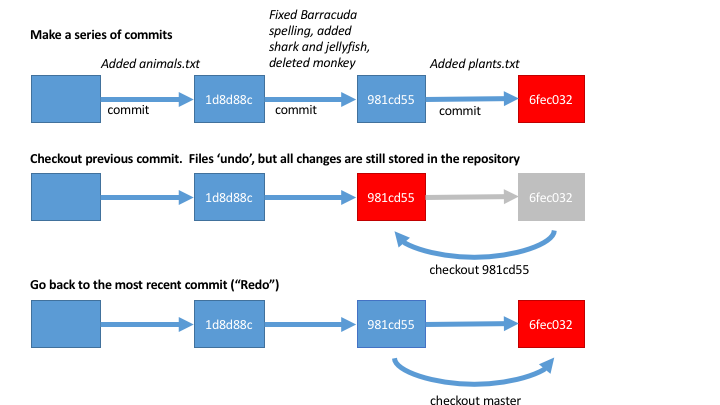
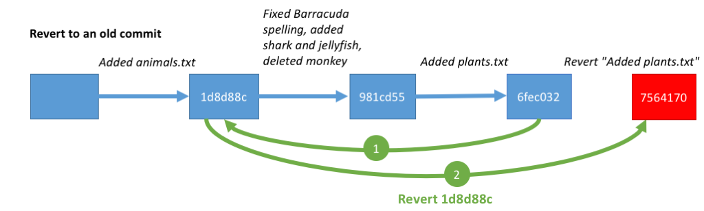

# Introduction

In this tutorial, we'll learn the basics of the program git:

-  Initialise a repository
-  Adding files to track
-  Making and committing changes
-  Undoing and redoing (checkout and revert)

## Initialise a git repository

After navigating to the `tutorial1` folder, let's initialise a repository, type `git init` and press enter:

	> git init
	Initialized empty Git repository in /Users/sgroberts/Documents/Teaching
	  /IntroToGitHub/TutorialFolders/tutorial1/.git/

This created a hidden folder in our directory called `.git`.  You may not be able to see it in your file browser, but that's ok - we don't need to look inside for now.

Let's check the status of the repository:

	> git status

You should get something like this:

	On branch master

	Initial commit

	Untracked files:
	  (use "git add <file>..." to include in what will be committed)

		animals.txt

	nothing added to commit but untracked files present (use "git add" to track)

Git is telling us that we're on the master branch, labelled 'Initial commit'.  It also says that there are untracked files in our folder.  That means that there are files that the repository is not tracking yet.

## Adding files to the repository

Let's add the file `animals.txt` to the repository:

	> git add animals.txt

Now we can look at the status again:
	
	> git status
	
	On branch master

	Initial commit

	Changes to be committed:
	  (use "git rm --cached <file>..." to unstage)

		new file:   animals.txt

It says that there's a new file waiting to be commited.  

## Commiting changes

Let's commit this file!  

A commit is done with the git `commit` option.  Every time we commit we need to add a **commit message** about the changes we made.  This will come in useful later.  The message can be anything you like, but should make it clear what the changes you made are.

To add a commit message, use the `-m` option, then surround a short message surrounded by double quotes:

	> git commit -m "Added animals.txt"

	[master (root-commit) 3a397b1] Added animals.txt
	 1 file changed, 4 insertions(+)
	 create mode 100644 animals.txt

The message tells us that the commit contained a change to 1 file with 4 insertions.  Git tracks changes to each line of each file. The 4 insertions are the 4 lines of text inside `animals.txt`.

### Making changes

Let's edit the `animals.txt` file to the following:

<pre>
Donkey
Shark
Dolphin
Barracuda
Jellyfish

</pre>

Save the text file.

Note that we fixed the spelling of "Barracuda", deleted *Monkey* and added *Shark* and *Jellyfish*.  If we run `git status` again, git shows us the files that have changed since the last commit:

	> git status

	On branch master
	Changes not staged for commit:
	  (use "git add <file>..." to update what will be committed)
	  (use "git checkout -- <file>..." to discard changes in working directory)

		modified:   animals.txt

	no changes added to commit (use "git add" and/or "git commit -a")

We can also look at more detailed information on what has changed since the last commit with `git diff`

<pre>
> git diff
	
diff --git a/animals.txt b/animals.txt
index c7896ad..b35d465 100644
--- a/animals.txt
+++ b/animals.txt
@@ -1,4 +1,5 @@
 Donkey
+Shark
 Dolphin
-Monkey
-Baracuda
+Barracuda
+Jellyfish
</pre>

This tells us that there have been chagnes to the file `animals.txt`.  Additions are coloured in green and deletions are coloured in red.  Note that the editing of "Baracuda" has been counted as a deletion and an addition.

### Committing changes again

We haven't added the changes yet, so let's do that:

	> git add animals.txt

This command tells git to add all changes in all files inside the working directory (and all files in sub-directories inside the working directory).

Let's commit these changes:

	> git commit -m "Fixed Barracuda spelling, added shark and jellyfish, deleted monkey"

	[master bc7f5ac] Fixed Barracuda spelling, added shark and jellyfish, deleted monkey
	 1 file changed, 3 insertions(+), 2 deletions(-)

Git tells us that 1 file has changed, and we've made 3 insertions and 2 deletions.

The command `git log` shows us the history of commits, starting with the most recent commit:

	> git log

	commit bc7f5ac9be1fe3dc8a4a779d81e17bf5f6bb7962
	Author: seannyD <sean.g.roberts@gmail.com>
	Date:   Sun Jul 3 12:15:42 2016 +0200

	    Fixed Barracuda spelling, added shark and jellyfish, deleted monkey

	commit 3a397b1bc84f63f149a87f893e5013090f65968b
	Author: seannyD <sean.g.roberts@gmail.com>
	Date:   Sun Jul 3 11:59:25 2016 +0200

	    Added animals.txt

## Undo and Redo

We'd like to undo the changes made to `animals.txt` since the last commit.  The first step is to get the ID of the commit we want to go back to.  Use `git log --online` to show a list of commits with just the IDs and commit messages:

	> git log --oneline

	981cd55 Fixed Barracuda spelling, added shark and jellyfish, deleted monkey
	6fec032 Added animals.txt

The line starts with an ID code for the commit, and the message we entered for the commit.  This is why the commit messages are important.  It's tempting to be vague in the message, but documenting changes makes it easier to do stuff later on!

We want to go back to commit `6fec032`.

To undo changes to a file since the last commit, you can use the `checkout` command.  It takes two main arguments - the ID of the commit, and what file you want to checkout.

	> git checkout 6fec032 animals.txt

Re-open the `animals.txt` file again.  You should see that the contents of the file have been changed back to how it was at the first commit.  You can now edit this file, and then add these chagnes to the repository and make new commits, just like before.

You can change the file back to the most recent commit ("redo") by checking out the HEAD:

	> git checkout HEAD animals.txt

The file should now have 5 animals again.

### Tracking multiple files

Let's make another text file inside the `tutorial1` folder called `plants.txt` with the following text:

<pre>
oak
daffodil

</pre>

We could add this file to the repository with `git add plants.txt`, but we can also add *all* files in the directory like this:

	> git add *

This would also add *all files in sub-directories*.  Let's commit the changes:

	> git commit -m "Added plants.txt"

	[master 1d8d88c] Added plants.txt
	 1 file changed, 2 insertions(+)
	 create mode 100644 plants.txt

### Checking out all files

We can now use `checkout` to undo *all* files back to a previous commit.

First, let's find the ID:

	>git log --oneline

	1d8d88c Added plants.txt
	981cd55 Fixed Barracuda spelling, added shark and jellyfish, deleted monkey
	6fec032 Added animals.txt

Let's go back to the commit before we added plants.txt:

	> git checkout 981cd55

	Note: checking out '981cd55'.

	You are in 'detached HEAD' state. You can look around, make experimental
	changes and commit them, and you can discard any commits you make in this
	state without impacting any branches by performing another checkout.

	If you want to create a new branch to retain commits you create, you may
	do so (now or later) by using -b with the checkout command again. Example:

	  git checkout -b <new-branch-name>

	HEAD is now at 981cd55... Fixed Barracuda spelling, added shark and jellyfish, deleted monkey

Now the folder will go back to how it looked before - we only have one file `animals.txt`.

We get quite a long message warning us that we're in a 'detached HEAD' state.  This means that you can make any changes you want to the files in your directory and also make commits of these changes, but you can always return all files to the state that they were in

	> git checkout master

Here's a diagram of what we did:

One good use for academia is to make a commit when you submit a project to a journal or conference.  Mark this as e.g. "Version submitted to Nature".  When you get revisions back from reviewers, you can check what the project looked like when you submitted.

### Reverting to a previous state

The checkout command lets us "check out" the state of files at a previous time.  But if we want to actually want to reverse the changes and keep working on the files as they were before, then we need to "revert".  Let's revert back to the state after we added `animals.txt`.

	> git revert 1d8d88c

You'll be asked for a revert message.  The default is fine.

*Note that on some systems, you'll be asked to write the revert message in a terminal-based editor like vim.  Usually you can type `:` then `q` to continue.*

This command actually 'undoes' everything back to the commit we specified, but then works out the changes between that and the current commit, and adds a *new* commit at the end.

There's now an extra commit in the log.  Doing it this way means that we can undo changes, but still go back to the way the project looked after we fixed the barracuda spelling etc., if we want.

## Review

In this tutorial, we learned how to initialise a repository: add files and commit changes:

	> git init

Then we make changes, add changes to the repository and commit the changes to the repository:

	> git add *
	> git commit -m "Put a message here to describe the changes"

The two commands above are the ones you'll use the most.

We can also look at a list of commits to find commit ids:

	> git log --oneline

And go back to a previous state of a file:

	> git checkout <commit id> fileName.txt

Or 'revert' back to a previous state of the whole project:

	> git revert <commit id>

----

### [Go on to the next section](Tutorial2.html)