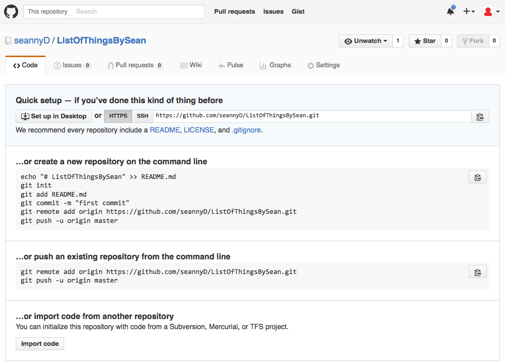
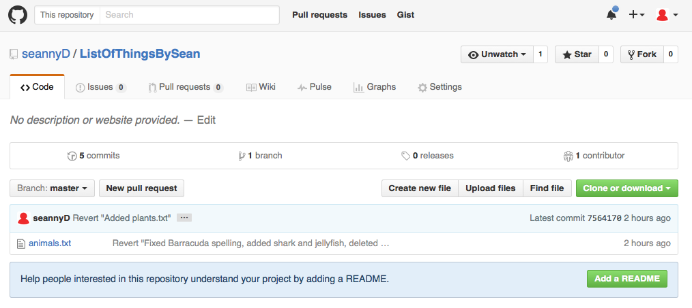

# [Back to Tutorial 1](Tutorial1.html)

# Introduction

In this tutorial, we'll learn how to link a repository to GitHub.

To start, open your terminal / GitBash and **navigate to the folder you made in tutorial 1**.

## WARNINGS

GitHub repositories are **public** by default.  That means that anything you upload to GitHub can be seen by others.  It also means that other people can see **any data that exists in your commit history**.  This can include old drafts of papers or data before it was anonymised.

If you pay for a github membership, you can create private repositories, or you can use other services.  e.g.:

-  [Apache Subversion (svm)](https://subversion.apache.org/).  There's a local, secure repository available from the Nijmegen MPI TG, [svn.mpi.nl](svn.mpi.nl).
-  [Gitlab](https://gitlab.gwdg.de) hosting service, available through MPG (https://gitlab.gwdg.de).

See the last tutorial for a way of making sure some files are not included in the repository.

## Set your git username

When collaborating, it's good to know who makes what changes.  You can tell git what your github username and email address is using `git config`.

My github name is seannyD and my email is sean.roberts@hotmail.com, so I would use:

	> git config --global user.name "seannyD"
	> git config --global user.email "sean.roberts@hotmail.com"

Set your own username and email now.

*Note that the "--global" command sets your username for all repositories.  You can set the username just for the current repository by navigating to the repository and using e.g. `git config user.name "seannyD"`.*

## Adding a remote repository

In tutorial 1 we created a git repository.  Let's link that to an online repository on GitHub.com.

-  Go to [www.github.com](www.github.com) and log in.
-  Click 'New repository'
-  Choose a name for the repository.  This must be unique for all of GitHub, so make it obvious.  For this tutorial, make it something like "ListOfThingsBySean".
-  Click 'Create repository' (the default options are fine, and you can add a description later)

You'll get a page like this:

Currently, the repository is empty, so it gives you four options:

-  quick setup deatils (if you know what you're doing)
-  create a new repository on the command line
-  push an existing repository from the command line
-  import code from another repository

It also gives some code.  Note that the second option has some familiar commands: git init, git add and git commit.

But we already have a repository, so we want the third option: "push an existing repository from the command line".  Copy the two lines of code and paste them into your terminal / GitBash.  My code looks like this, but you'll need to **replace the web address** with your own repository address.

	> git remote add origin https://github.com/seannyD/ListOfThingsBySean.git
	> git push -u origin master

The first command tells git that you're going to link the repository to the given web address.

The second command tells git to upload the repository to GitHub.  The `-u origin master` tells git to push the master branch to GitHub, and to remember this option for later.  From now on, you can just use `git push` to send things to GitHub.

You'll need to enter your GitHub password.  There are a number of ways of avoiding doing this every time, see [here](https://help.github.com/articles/caching-your-github-password-in-git/).

After the files have uploaded, go back to the GitHub page in your browser and refresh the page.  You'll see something like this:

The files in your directory are now copied to the GitHub page, and other people can access it.  It will updated every time you make a commmit and push.

There are lots of options things on this page, but one of the most useful for now is the ability to add collaborators - people who can edit and push to your online GitHub repository.  To do this, go to *Settings* > *Collaborators* and enter the username/email address of collaborators.

## Review

We've now learned the basics of git:

Initialise a repository

	> git init
	
Make a GitHub repository on GitHub.com, then link your local repository to it:

	> git remote add origin <repository url>
	> git push -u origin master

You'll now be mainly using these three commands every time you make changes:

	> git add *
	> git commit -m "Commit description message"
	> git push
	
You can now appreciate this comic:

*From xkcd https://xkcd.com/1597/*

----

### [Go on to the next section](Tutorial3.html)