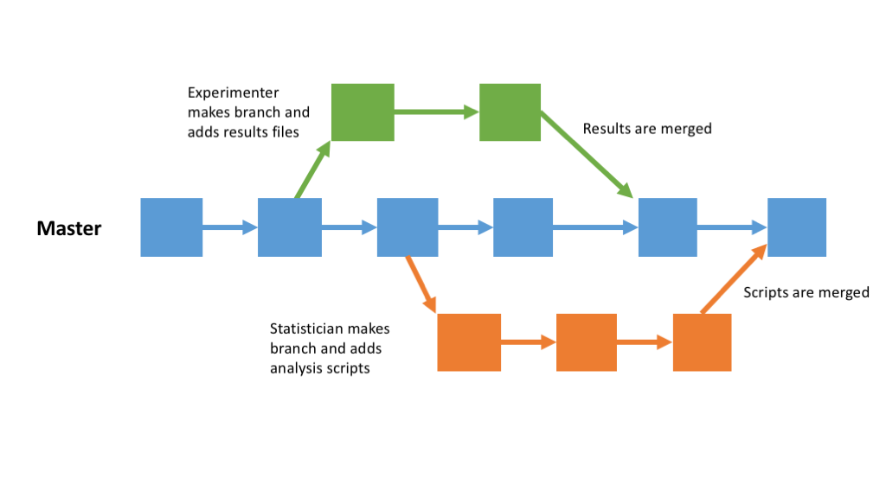
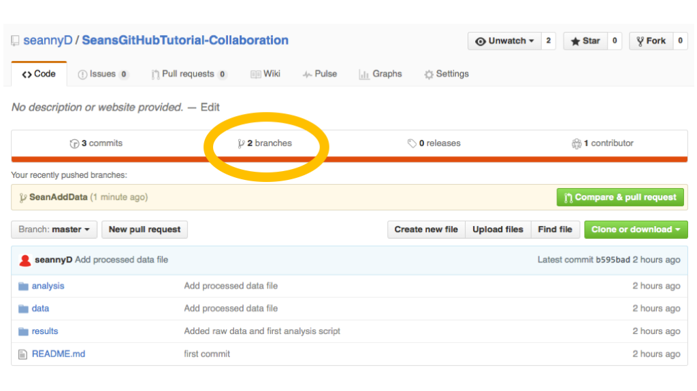
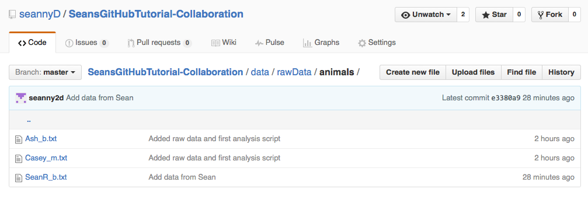

# [Back to Tutorial 1](Tutorial1.html)
# [Back to Tutorial 2](Tutorial2.html)

# Introduction

In this tutorial, we'll learn how to collaborate on projects using git and GitHub.

To do this tutorial, you'll need to be added as a collaborator on one of my GitHub projects.  If you haven't sent me your GitHub username, please email me.

## Designing projects for collaboration

### File structure

It's a good idea to have a very clear file structure for your project.  This means that it's easy to locate files, and it's obvious where new files or changes should go.

I usually have something like this:

*  Main folder (Top folder for the version control)
  *  data
     *  Raw data
     *  Processed data
  *  processing  (any scripts for processing raw data)
     *  R
     *  Python  
  *  analysis (any scripts for analysing results)
     *  R
  *  results (for storing results)
     *  graphs
  *  writeup (for storing drafts of articles)

### Reproducability

An ideal GitHub project will be completely self-sufficient and reproducible.  That is, someone else should be able to download just the files that are in the repository, and reproduce all your results and output.  To achieve this, consider

-  Including all raw data inside the repository
-  Including all scripts that process the data and produce graphs/results
-  Using relative file paths in scripts.  This means you should use paths like "../../data/RawData/Part1.csv", rather than "C:/MyDocuments/Sean/LingProjects/data/RawData/Part1.csv".  This means that the scripts should run on somebody else's computer.

### Documentation

Documentation is important.  It means having a "README" file for the project / each subflder, describing the contents of each file.  If you include a file named "README.md" in the top directory of your repository, GitHub will use this as the project's main page on the web.  You should also document your code, describing what each function and set of lines does.

## Collaboration on a GitHub project

I made a GitHub project here:

[https://github.com/seannyD/SeansGitHubTutorial-Collaboration](https://github.com/seannyD/SeansGitHubTutorial-Collaboration)

Go to this page and have a look at the files and folders.  It's a project for a timed list experiment.  Participants have to list as many items from a semantic domain as possible.  The responses are written to a file, one line per response.  Like this:

<pre>
cow
pig
sheep
salmon

</pre>

The raw files can be found in the folder [data/rawData/animals](https://github.com/seannyD/SeansGitHubTutorial-Collaboration/tree/master/data/rawData/animals).

The name of the file is the participant name/id followed by an underscore, then either 'm' or 'b', indicating if the participant was brought up monolingually or bilingually.

There is an R script for collating and analysing the data in `analysis/R/analyseData.Rmd`, and this writes the results to `results/MainResults.html`.

### Cloning a repository

We'd like to add your own resonses to the project.  The first step is to clone the repository from GitHub to your own local machine.

Make another folder for this collaboration tutorial.  Make sure it is **not inside the folder for the previous tutorial**, or inside any other folder which already has a github repository.

Navigate to this folder in your terminal / GitBash.  For me it's something like:

	> cd ~/Documents/Teaching/IntroToGitHub/TutorialFolders/collaborationTutorial

Next we need to find the URL of the repository.  Go to my repository page:

[https://github.com/seannyD/SeansGitHubTutorial-Collaboration](https://github.com/seannyD/SeansGitHubTutorial-Collaboration)

Look for a button labelled 'Clone or download'.  Click it and a little box will appear with a link.  Copy this link.

The link should be:

	https://github.com/seannyD/SeansGitHubTutorial-Collaboration.git

Note that this is just the url of the main page for the project, but with ".git" at the end.

In your terminal, type

	> git clone https://github.com/seannyD/SeansGitHubTutorial-Collaboration.git
	
You should see output like this:

	Cloning into 'SeansGitHubTutorial-Collaboration'...
	remote: Counting objects: 26, done.
	remote: Compressing objects: 100% (20/20), done.
	remote: Total 26 (delta 3), reused 26 (delta 3), pack-reused 0
	Unpacking objects: 100% (26/26), done.
	Checking connectivity... done.

Git should now download both the files and the repository structure to your machine.  You should have a folder inside your working directory named `SeansGitHubTutorial-Collaboration`.

## Branching

We're now going to edit our local version of the project, then upload our edits to the main project.  Because other people might be working on this project at the same time, we want to work on a **branch**.

The idea is that people can work on their own branches independently, then **merge** the branches into the master branch later.

Now that we've cloned the repository, let's navigate inside the project folder.  You should type something like:

	> cd SeansGitHubTutorial-Collaboration
	
Let's check which branch we're on:

<pre>
> git branch 
* master 
</pre>

This repository only has one brach - the master branch - and that's our currently checked-out branch (you can tell by the * symbol).

Now we can make our own branch to work on.  I'm going to call  my branch "SeanAddData", but you should name it something so that it's clear what's going on in this branch.

	> git branch SeanAddData
	
Let's check the branches again:

<pre>
> git branch 
    SeanAddData
  * master 
</pre>
	
There are now two branches, but the master banch is still the checked-out one.

Let's checkout our branch (remember, your branch name will be different):

	> git checkout SeanAddData
	Switched to branch 'SeanAddData'
	
## Making changes

We can now make changes as before.  

***Add your own responses file*** to data/rawData/animals/.  Make sure there's one response per line, and that you name file something like "YourName_m.txt" (where m is monolingual and b is bilingual).

***Add your changes to the repository branch***

	> git add *

***Commit your changes***, adding a commit message that makes sense:

	> git commit -m "Added data from <Your name>"

#### Pushing the branch back to GitHub

***Push your branch to the GitHub repository***.  The first time we do this, we need to tell git that we want the 'upstream' branch to be the GitHub branch (the 'origin').

	> git push --set-upstream origin <Your branch name>
	
You should get output like this:

	Counting objects: 6, done.
	Delta compression using up to 4 threads.
	Compressing objects: 100% (6/6), done.
	Writing objects: 100% (6/6), 647 bytes | 0 bytes/s, done.
	Total 6 (delta 1), reused 0 (delta 0)
	To https://github.com/seannyD/SeansGitHubTutorial-Collaboration.git
	 * [new branch]      SeanAddData -> SeanAddData
	Branch SeanAddData set up to track remote branch SeanAddData from origin.

If we go back to the GitHub website, we now see that the project has 2 branches:

## Merging branches

The owner of the GitHub project can actually compare and merge branches directly on GitHub.  There are many powerful features such as allowing people who have created branches to request that the owner merge their branch, and a discussion forum for debating how merges should happen.

However, for now we'll just show how to merge branches on the command line.  

In what follows, I assume that a collaborator (you):

-  cloned the repository
-  made a branch
-  commited changes to the branch
-  pushed the changes to the main GitHub page

In the next section, the owner (me) will:

-  pull this change to their own local repository
-  merge the branches 
-  and then push the updated branch back to GitHub.

#### Pull the most recent changes

The first step is to make sure that your repository is up to date.  Others may have made changes since you created your branch.  You can pull changes at any time, even if you don't intend to merge branches.

First, let's make sure we've switched back to the master branch:

	> git branch master
	
Now let's **pull** new data from GitHub (this is the opposite of **push**).

	> git pull
	
	remote: Counting objects: 6, done.
	remote: Compressing objects: 100% (5/5), done.
	remote: Total 6 (delta 1), reused 6 (delta 1), pack-reused 0
	Unpacking objects: 100% (6/6), done.
	From https://github.com/seannyD/SeansGitHubTutorial-Collaboration
	 * [new branch]      SeanAddData -> origin/SeanAddData
	Already up-to-date.
	
#### Merging branches

Let's check the branches we have available.  Note that we're using the `-a` option to make sure we see local and remote branches.

	>	git branch -a
	* master
	  remotes/origin/SeanAddData
	  remotes/origin/master
	  
Our checked-out branch is the master branch, and can see the new branch (origin/SeanAddData).  Let's merge it in using the `merge` command:

	> git merge origin/SeanAddData
	
	Updating b595bad..e3380a9
	Fast-forward
	 data/rawData/animals/SeanR_b.txt | 9 +++++++++
	 1 file changed, 9 insertions(+)
	 create mode 100644 data/rawData/animals/SeanR_b.txt
	 
We get a message saying that 1 file was added to the master branch.
	 
And let's push the changes to GitHub:

	> git push

On the website, we can see that the rawData folder has a new file (SeanR_b.txt) in it, with the commit message that we made in our branch.

## Viewing other people's changes

When you pull updates from GitHub, you'll probably want to know what's changed.  First, let's see what the commit messages are like:

	> git log --oneline

	2a06936 edited readme
	e3380a9 Add data from Sean
	b595bad Add processed data file
	d4d7a4f Added raw data and first analysis script
	26bf47a first commit
	
Let's say we want to find out what happened between "Add data from Sean" and "edited readme".  We can use `git diff` followed by the two commit IDs we want to compare.

	> git diff e3380a9 2a06936
	
This gives the following output:

<pre>
<b>diff --git a/README.md b/README.md
index 5d4f2d8..9a02461 100644
--- a/README.md
+++ b/README.md</b>
@@ -1 +1,9 @@
-# Collaboration tutorial# SeansGitHubTutorial-Collaboration
+# Collaboration tutorial
+
+It's a project for a timed list experiment.  Participants have to
 list as many items from a semantic domain as possible.  The 
 responses are written to a file, one line per response.
+
+The raw files can be found in the folder [data/rawData/animals]
(https://github.com/seannyD/SeansGitHubTutorial-Collaboration/tree/master/data/rawData/animals).
+
+The name of the file is the participant name/id followed by an 
underscore, then either 'm' or 'b', indicating if the participant was
 brought up monolingually or bilingually.
+
+There is an R script for collating and analysing the data in 
`analysis/R/analyseData.Rmd`, and this writes the results to 
`results/MainResults.html`.
<b>
diff --git a/data/.DS_Store b/data/.DS_Store
index fc68288..a3d5c16 100644</b>
Binary files a/data/.DS_Store and b/data/.DS_Store differ
<b>diff --git a/data/rawData/.DS_Store b/data/rawData/.DS_Store
index 5008ddf..60cf046 100644</b>
Binary files a/data/rawData/.DS_Store and b/data/rawData/.DS_Store differ
</pre>

This means that there were edits to **README.md**.  The line at the start of the file "# Collaboration tutorial# SeansGitHubTutorial-Collaboration", was deleted and several other lines were added.  Basically, the last edit just updated the README file to include a fuller description.

## Merging branches in your local project

In the example above, the collaborators made branches, then the project owner merged them.  But you can merge branches in your own local repository.  You can use `merge` in the same way as above:

Make sure you're in the branch you want to merge *into* (e.g. the master branch:

	> git branch master

Then merge the branches

	> git merge NameOfBranchToMerge
	
## Review

In this tutorial we learned how to view branches:

	> git branch 
	
... create new branches:

	> git branch newBranchName

... switch branches:

	> git branch nameOfBranchToSwitchTo
	
We learned that, if you're collaborating, development should always be done on a branch, not the master.  We can make changes to our local branch with `git add` and `git commit` as before.  We can push our branch to the GitHub page with `git push`.  When we're done, we can merge branches:

	> git merge branchToMergeFrom
	
----

### [Go on to the next section](Tutorial4.html)