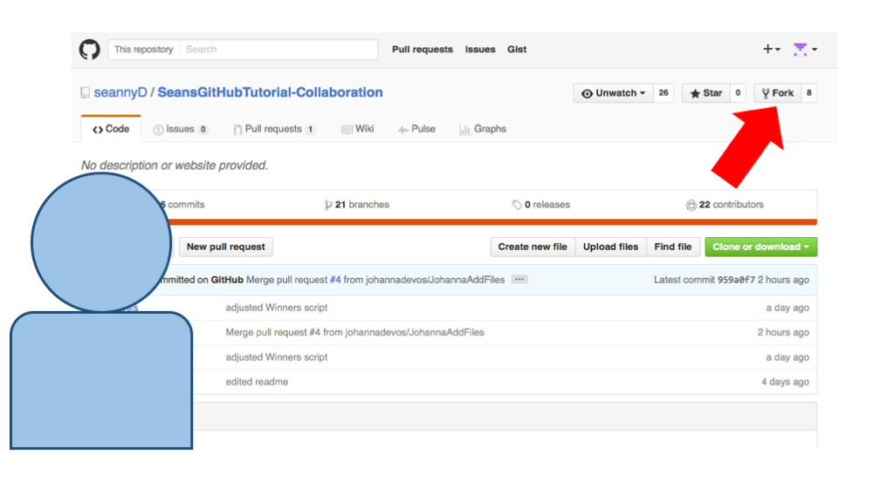
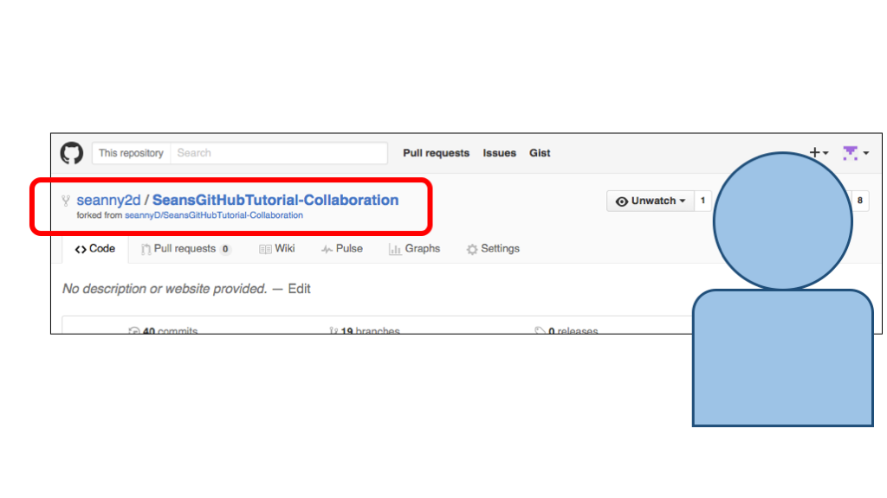
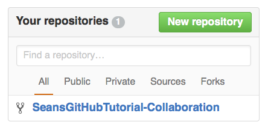
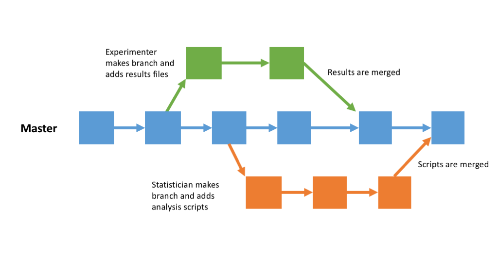
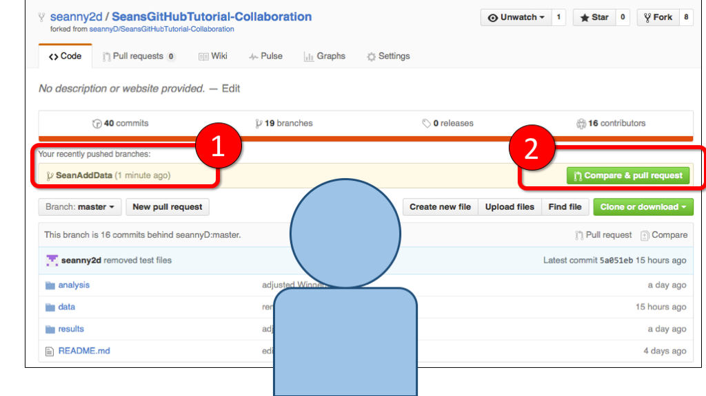
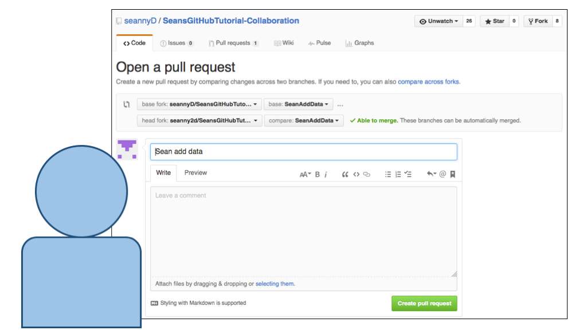
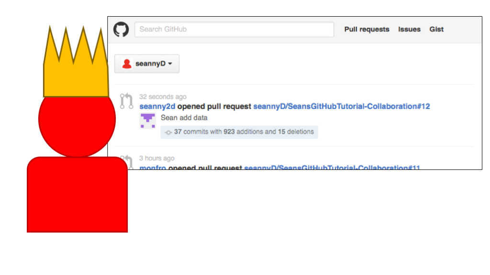
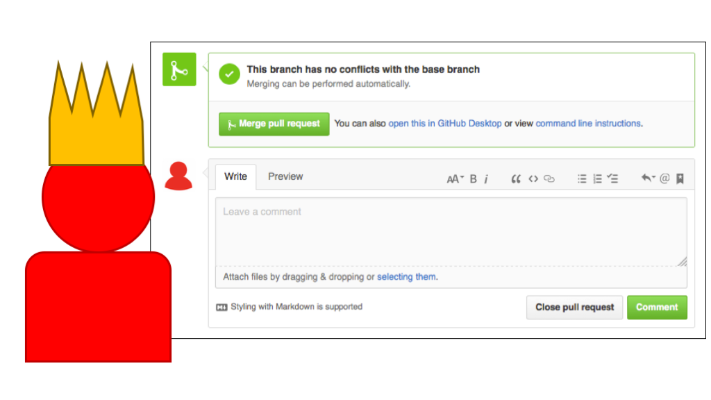
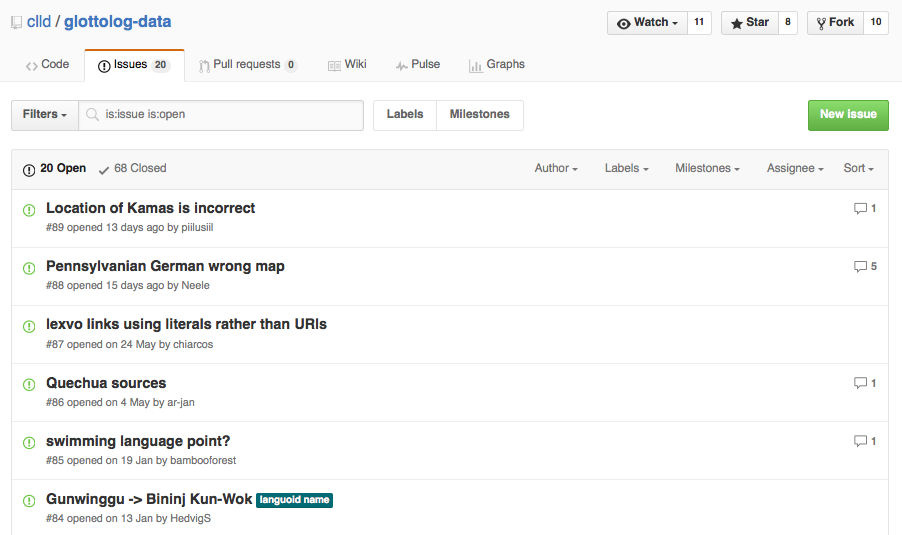

# [Back to Tutorial 1](Tutorial1.html)
# [Back to Tutorial 2](Tutorial2.html)

# Introduction

In this tutorial, we'll learn how to collaborate on projects using git and GitHub.

To do this tutorial, you'll need to be added as a collaborator on one of my GitHub projects.  If you haven't sent me your GitHub username, please email me.

## Designing projects for collaboration

### File structure

It's a good idea to have a very clear file structure for your project.  This means that it's easy to locate files, and it's obvious where new files or changes should go.

I usually have something like this:

*  Main folder (Top folder for the version control)
  *  data
     *  Raw data
     *  Processed data
  *  processing  (any scripts for processing raw data)
     *  R
     *  Python  
  *  analysis (any scripts for analysing results)
     *  R
  *  results (for storing results)
     *  graphs
  *  writeup (for storing drafts of articles)

### Reproducability

An ideal GitHub project will be completely self-sufficient and reproducible.  That is, someone else should be able to download just the files that are in the repository, and reproduce all your results and output.  To achieve this, consider

-  Including all raw data inside the repository
-  Including all scripts that process the data and produce graphs/results
-  Using relative file paths in scripts.  This means you should use paths like "../../data/RawData/Part1.csv", rather than "C:/MyDocuments/Sean/LingProjects/data/RawData/Part1.csv".  This means that the scripts should run on somebody else's computer.

### Documentation

Documentation is important.  It means having a "README" file for the project / each subflder, describing the contents of each file.  If you include a file named "README.md" in the top directory of your repository, GitHub will use this as the project's main page on the web.  You should also document your code, describing what each function and set of lines does.

## Collaboration on a GitHub project

I made a GitHub project here:

[https://github.com/seannyD/SeansGitHubTutorial-Collaboration](https://github.com/seannyD/SeansGitHubTutorial-Collaboration)

Go to this page and have a look at the files and folders.  It's a project for a timed list experiment.  Participants have to list as many items from a semantic domain as possible.  The responses are written to a file, one line per response.  Like this:

<pre>
cow
pig
sheep
salmon

</pre>

The raw files can be found in the folder [data/rawData/animals](https://github.com/seannyD/SeansGitHubTutorial-Collaboration/tree/master/data/rawData/animals).

The name of the file is the participant name/id followed by an underscore, then either 'm' or 'b', indicating if the participant was brought up monolingually or bilingually.

There is an R script for collating and analysing the data in `analysis/R/analyseData.Rmd`, and this writes the results to `results/MainResults.html`.

I'm the owner of the project, which means I make all the decisions about how edits are done.  This is me:

You'll be a contributor, this is what you look like:

If the repository is public, you don't need permission to download the repository nor to make changes.  But I'm the only one who can merge your changes into the main project.  (Actually, "collaborators" can also do this, but that's another issue).

### Overview

Let's say you'd like make changes to the project.  We'll take the following steps:

-  **Fork** the master GitHub repository
-  **Clone** the forked repository onto our local system
-  Make a new **branch** of the project
-  Edit the branch to make our changes
-  Add and commit our changes
-  Make a pull request to the master repository
-  The owner then accepts the request and merges your changes into the master project

## Forking a GitHub repository

Go to github.com and sign in.

Got to (https://github.com/seannyD/SeansGitHubTutorial-Collaboration)[https://github.com/seannyD/SeansGitHubTutorial-Collaboration]

Click on the "Fork" button in the top right corner.  This will make a copy of the project *on the github server* (not your local machine).

After a few moments, you'll have a new page which shows your forked repository.

Note that the top left of the screen tells you it's a fork:

If you were to go back to your GitHub homepage, you'd see a tab on the right looking like this:

Note the little 'fork' symbol next to the project name.

This is now *your* project.  But GitHub knows that it's a copy of another project, and it'll do some smart things later to help us merge changes.

### Clone the forked repository

Next we need to find the URL of the repository.  Go to your GitHub fork page and find the "clone" button:

Click it and a little box will appear with a link.  Copy this link (make sure the link starts with "https").

Make another folder for this collaboration tutorial.  Make sure it is **not inside the folder for the previous tutorial**, or inside any other folder which already has a github repository.

Navigate to this folder in your terminal / GitBash.  For me it's something like:

	> cd ~/Documents/Teaching/IntroToGitHub/TutorialFolders/collaborationTutorial

Now let's clone the repository.  In your terminal, type

	> git clone https://github.com/seannyD/SeansGitHubTutorial-Collaboration.git
	
You should see output like this:

	Cloning into 'SeansGitHubTutorial-Collaboration'...
	remote: Counting objects: 26, done.
	remote: Compressing objects: 100% (20/20), done.
	remote: Total 26 (delta 3), reused 26 (delta 3), pack-reused 0
	Unpacking objects: 100% (26/26), done.
	Checking connectivity... done.

Git should now download both the files and the repository structure to your machine.  You should have a folder inside your working directory named `SeansGitHubTutorial-Collaboration`.

Navigate inside this folder:
	
	> cd SeansGitHubTutorial-Collaboration

We can now look at the commits:

	> git log --oneline
	
	959a0f7 Merge pull request #4 from johannadevos/JohannaAddFiles
	7e54ceb Merge pull request #5 from kreetrapper/alexbranch
	5e64f0a Merge pull request #9 from LiekeHofmans/liekefile
	266af8f Merge pull request #6 from karinilse/karins_animals
	4ec4311 Merge pull request #8 from wirrbeltier/MoritzAddFiles
	35bc040 Merge pull request #10 from seanny2d/SeanAddFiles
	3436a10 Merge pull request #11 from seannyD/monjabranch
	0c85579 Merge pull request #3 from seannyD/MarkAddFiles
	0c25a2f "Added Johanna's files # On branch JohannaAddFiles"
	077615d added animals file from Moritz
	8445c9d added data from Lieke
	a8550e1 Added data from Sean
	883b41f Added data from Alex
	80d4ef4 added data of Monja
	6ebe240 added data from karin
	7aefae8 adding md_m.txt
	5a051eb removed test files
	ebd8d61 Merge pull request #2 from seanny2d/testBranch
	cf7c705 test branch added
	9eb8ef8 Merge pull request #1 from seanny2d/master
	1fe2ffa add test file
	3705b5c adjusted Winners script
	ec2a9e4 winner code fix
	
There are lots of commits!  In fact, more than can be displayed in the terminal at one time.  You can press 'Enter' to scroll through the rest of the commits, or press 'q' to get back to the command prompt.

## Branching

We're now going to edit our local version of the project, then upload our edits to the main project.  Because other people might be working on this project at the same time, we want to work on a **branch**.

The idea is that people can work on their own branches independently, then **merge** the branches into the master branch later.

Let's check which branch we're on:

<pre>
> git branch 
* master 
</pre>

This repository only has one brach - the master branch - and that's our currently checked-out branch (you can tell by the * symbol).

Now we can make our own branch to work on.  I'm going to call  my branch "SeanAddData", but you should name it something so that it's clear what's going on in this branch.

	> git branch SeanAddData
	
Let's check the branches again:

<pre>
> git branch 
    SeanAddData
  * master 
</pre>
	
There are now two branches, but the master banch is still the checked-out one.

Let's checkout our branch (remember, your branch name will be different):

	> git checkout SeanAddData
	Switched to branch 'SeanAddData'

	
## Making changes

We can now make changes as before, but now safely on your own branch.

If you haven't already, make a new text file and list in it as many animals as you can in 30 seconds.

***Add your own response file*** to data/rawData/animals/.  Make sure there's one response per line, and that you name file something like "YourName_m.txt" (where m is monolingual and b is bilingual).

***Add your changes to the repository branch***

	> git add *

***Commit your changes***, adding a commit message that makes sense:

	> git commit -m "Added data from <Your name>"

### Pushing the branch back to GitHub

***Push your branch to the GitHub repository***.  The first time we do this, we need to tell git that we want the 'upstream' branch to be the GitHub branch (the 'origin').

	> git push --set-upstream origin <Your branch name>
	
You should get output like this:

	Counting objects: 6, done.
	Delta compression using up to 4 threads.
	Compressing objects: 100% (6/6), done.
	Writing objects: 100% (6/6), 647 bytes | 0 bytes/s, done.
	Total 6 (delta 1), reused 0 (delta 0)
	To https://github.com/seannyD/SeansGitHubTutorial-Collaboration.git
	 * [new branch]      SeanAddData -> SeanAddData
	Branch SeanAddData set up to track remote branch SeanAddData from origin.

##  Making a pull request

If we go back to your fork project on the GitHub website, we now see two things:

1.  that the project has one more branch, and that the latest commit was a few seconds ago, with the commit message you made.
2.  There's a button labelled "Compare and Pull request"

Click on "Compare and Pull request".  You'll get a page like this:

You can add a title to your pull request, and even write a comment.  When you're collaborating with lots of people, this is very useful.  You can describe your change in detail, and argue why your change should become part of the main project.  Later on, GitHub offers a forum for people to discuss this.

Fill in a message and click "Create pull request".

Now a message is sent to me, the owner, that you've made a request.  This is what I see on my GitHub homepage:

I click on the link, and I get a summary of the changes you made.  I then get two options:

The first tells me there are no conflicts between our versions, so I can "Merge pull request".  Or I can add a comment that will be sent to you, perhaps explaining why this shouldn't be added, asking for clarification or asking for a particular change.

I click "Merge pull request" (and I get a chance to add my own comment which will become part of a commit message).

After I've confirmed the merge, your changes will show up on the main project page (not just your fork).  Your changes are now part of the master branch!

### Updaing your local copy

You made changes and I merged them into the master project, but you don't have the most up to date version yet on your local machine.  So you should pull the changes from the server.  You can pull changes at any time, even if you don't intend to merge branches.

First, let's **make sure we've switched back to the master branch**:

	> git branch master
	
Now let's **pull** new data from GitHub (this is the opposite of **push**).

	> git pull
	
	remote: Counting objects: 6, done.
	remote: Compressing objects: 100% (5/5), done.
	remote: Total 6 (delta 1), reused 6 (delta 1), pack-reused 0
	Unpacking objects: 100% (6/6), done.
	From https://github.com/seannyD/SeansGitHubTutorial-Collaboration
	 * [new branch]      SeanAddData -> origin/SeanAddData
	Already up-to-date.
	

## Viewing other people's changes

When you pull updates from GitHub, you'll probably want to know what's changed.  First, let's see what the commit messages are like:

	> git log --oneline

	2a06936 edited readme
	e3380a9 Add data from Sean
	b595bad Add processed data file
	d4d7a4f Added raw data and first analysis script
	26bf47a first commit
	
Let's say we want to find out what happened between "Add data from Sean" and "edited readme".  We can use `git diff` followed by the two commit IDs we want to compare.

	> git diff e3380a9 2a06936
	
This gives the following output:

<pre>
<b>diff --git a/README.md b/README.md
index 5d4f2d8..9a02461 100644
--- a/README.md
+++ b/README.md</b>
@@ -1 +1,9 @@
-# Collaboration tutorial# SeansGitHubTutorial-Collaboration
+# Collaboration tutorial
+
+It's a project for a timed list experiment.  Participants have to
 list as many items from a semantic domain as possible.  The 
 responses are written to a file, one line per response.
+
+The raw files can be found in the folder [data/rawData/animals]
(https://github.com/seannyD/SeansGitHubTutorial-Collaboration/tree/master/data/rawData/animals).
+
+The name of the file is the participant name/id followed by an 
underscore, then either 'm' or 'b', indicating if the participant was
 brought up monolingually or bilingually.
+
+There is an R script for collating and analysing the data in 
`analysis/R/analyseData.Rmd`, and this writes the results to 
`results/MainResults.html`.
<b>
diff --git a/data/.DS_Store b/data/.DS_Store
index fc68288..a3d5c16 100644</b>
Binary files a/data/.DS_Store and b/data/.DS_Store differ
<b>diff --git a/data/rawData/.DS_Store b/data/rawData/.DS_Store
index 5008ddf..60cf046 100644</b>
Binary files a/data/rawData/.DS_Store and b/data/rawData/.DS_Store differ
</pre>

This means that there were edits to **README.md**.  The line at the start of the file "# Collaboration tutorial# SeansGitHubTutorial-Collaboration", was deleted and several other lines were added.  Basically, the last edit just updated the README file to include a fuller description.

### Merging branches in your local project

In the example above, the collaborators made branches, then the project owner merged them.  But you can merge branches in your own local repository.  You can use `merge` in the same way as above:

Make sure you're in the branch you want to merge *into* (e.g. the master branch:

	> git branch master

Then merge the branches

	> git merge NameOfBranchToMerge
	
## Review

In this tutorial we learned how to *fork* a GitHub repository.  We can then *clone* that fork to our local machine using:

	> git clone <web address of fork>

We also learned commands to view branches:

	> git branch 
	
... create new branches:

	> git branch newBranchName

... switch branches:

	> git branch nameOfBranchToSwitchTo
	
We learned that, if you're collaborating, development should always be done on a branch, not the master.  We can make changes to our local branch with `git add` and `git commit` as before.  We can push our branch to the GitHub page with `git push`.  When we're done, we can push our project to our fork page, then make a **pull request**.  If the owner of the project accepts the request, our changes will become part of the master project.

If we want, we can merge branches on our local machine:

	> git merge branchToMergeFrom
	
## Appliations in linguistics

The Glottolog database is a database of the world's languages, classified into families and sub-families:  [http://glottolog.org/](http://glottolog.org/).

It's edited and maintained through GitHub: [https://github.com/clld/glottolog-data](https://github.com/clld/glottolog-data).

This means you can fork this repository, clone it to your machine, make changes (e.g. add a new language, or change what family a language belongs to), then make a pull request.  The owners of glottolog will discuss your change, and may accept it.  Your change will then be reflected on the glottolog website and in the database.  You can change the course of linguistic history!

The GitHub webpage for Glottolog is also a place where people can raise issues, even if they're not familiar with git.  Here's some recent issues being discussed:

	
----

### [Go on to the next section](Tutorial4.html)